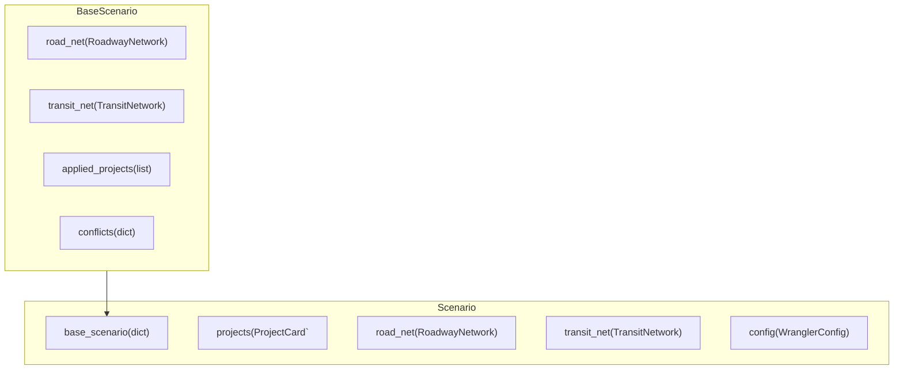

# Design

## Atomic Parts



NetworkWrangler deals with four primary atomic parts:

**1. [`Scenario`](api.md#network_wrangler.scenario.Scenario)** objects describe a Roadway Network, Transit Network, and collection of Projects. Scenarios manage the addition and construction of projects on the network via projct cards including required pre-requisites, co-requisites, and conflicts. Scenarios can be based on or tiered from other scenarios but must at the very least be based on an existing roadway and/or transit network defined in `base_scenario`.

**2. [`RoadwayNetwork`](api.md#network_wrangler.roadway.network.RoadwayNetwork)** objects stores information about roadway nodes, directed links between nodes, and the shapes of links (note that the same shape can be shared between two or more links). Network Wrangler reads/writes roadway network objects from/to three files: `links`, `shape`, and `nodes`. Their data is stored as GeoDataFrames in the object.

**3. [`TransitNetwork`](api.md#network_wrangler.transit.network.TransitNetwork)** objects contain information about the service (represented by the GTFS-compatable `Feed` object with stops, routes, trips, shapes, stoptimes, and frequencies tables), and how it maps to a `RoadwayNetwork`, stored as `road_net` attribute.  Network Wrangler reads/writes transit network information from/to gtfs-like files and stores them as DataFrames within.

**4.[`ProjectCard`](https://network-wrangler.github.io/projectcard/main/api/#projectcard.projectcard.ProjectCard)** objects store information (including  metadata) about changes to the network.  Network Wrangler uses the [`projectcard`](https://network-wrangler.github.io/projectcard) package to read project cards from .yaml-like files and validate them.

## Applying Projects

The basic functionality of NetworkWrangler is to apply a set of projects to a scenario.

```python
from project_card import read_cards
cards = read_cards([
    "projects/project_a.yml",
    "projects/project_b.yml",
    "projects/project_c.yml",
])
my_scenario.add_project_cards(cards.values())
my_scenario.queued_projects
>>  ["project_a", "project_b", "project_c"]
my_scenario.apply_projects(["project_a"])
my_scenario.applied_projects
>> ["project_a"]
my_scenario.queued_projects
>>  ["project_b", "project_c"]
my_scenario.apply_all_projects()
my_scenario.applied_projects
>> ["project_a", "project_b", "project_c"]
```

### Project Dependencies

Each project can specify any number of other projects (by project name) as a:

- `prerequisite`: list of projects that **must** be applied before this one.
- `corequisite`: list of projects that **must** be applied alongside this one (but not necessarily first).
- `conflicts`: list of projects that **must not** be applied to the same scenario as this one.

The Scenario object keeps track of the applied projects to make sure that these dependencies are enforced.

!!! warning "Base Scenarios with applied projects"

    Make sure your base scenario contains your applied projects and their conflicts.  This can be easily enforced by either loading a scenario from its .yml file or if you are seeding the base_scenario with an actual Scenario object instead of a dictionary.

### Order of project application

The order projects are applied defaults to the order they are specified in `my_scenario.projects`.  If a project card lists another project as a `prerequisite`, then NetworkWrangler will re-arrange the queued projects to make sure that is applied first.

This order can always be reviewed in `my_scenario.queued_projects`.

### Existing Values

You can control the behavior of Network Wrangler if existing value is not equal to the `existing` attribute in a ProjectCard as follows:

- `error`: Raise an error.
- `skip`: Skips applying the project.
- `warn`: Writes a warning about conflicting values. This is the global default.

These options can be set at the **global** configuration level by using WranglerConfig.

```yaml
EDITS:
    EXISTING_VALUE_CONFLICT: warn
```

This behavior can be overridden within a project card for a `roadway_property_change` or `transit_property_change` project for any individual `property_changes` item.

```yaml
transit_property_change:
    property_changes:
        headway_secs:
            existing: 360
            change: -180
            existing_value_conflict: error # this overrides the setting in WranglerConfig to error if the existing value is not 360.
```

### Scoped Roadway Property Changes

In some cases, properties of a roadway network may apply only during certain times of the day or for certain categories of users (e.g. trucks, HOV2, etc).  The Network Wrangler data model provides the ability to scope each property using the syntax described in the [network documentation](networks.md#links).

The value for a scoped property for a given link record is a list of [ScopedLinkValueItem](networks.md#links) objects.

::: network_wrangler.models.roadway.types.ScopedLinkValueItem
    options:
        show_bases: false
        show_root_toc_entry: false
        heading_level: 3
        show_source: false
        members: false

There are a few ways that network wrangler can treat conflicts:

- `conflicting` (default behavior):  overwrite any *conflicting* scoped properties for that property/link with what is given in the project card.
- `all`: overwrite *all* scoped properties for that property/link with what is given in the project card.
- `error`: raise an error when a conflict is detected.

These options can be set at the **global** configuration level by using WranglerConfig.

```yaml
EDITS:
    OVERWRITE_SCOPED: error # will default to raising an error if any scoped value in this specific property change conflicts with this scope.
```

This behavior can be overridden within a project card for a `roadway_property_change` project for any individual `property_changes` item.

```yaml
roadway_property_change:
    property_changes:
        sc_myproperty:
            set: 1
            scoped:
                timespan: [[12:00, 15:00]]
                set: 2
            overwrite_scoped: all # will overwrite all scopes in a link/property. Useful if you are completely defining something rather than amending.
```

## Selections

### Roadway

#### Segment

!!! example "Example Segment Facility Searches"

    ```yaml
    facility:
        links:
            name: ["6th", "Sixth", "sixth"] # find streets that have one of the various forms of 6th
        from:
            osm_node_id: "187899923"  # start searching for segments at this ID
        to:
            osm_node_id": "187865924" # end at this ID
    ```

    ```yaml
    facility:
        links:
            name: ["6th", "Sixth", "sixth"]
            lanes: [2, 3]  # from the initial connected segment search, only return links that are either 2 OR 3 lanes
        from:
            osm_node_id: "187899923"
        to:
            osm_node_id": "187942339"

    ```

When Network Wrangler conducts a search for a *facility*, it tries to navigate from the `from` node to the `to` node based on a network created from the initial selection values of: `name`, `ref`, `osm_link_id` and `model_link_id`.

If it cannot do so initially, it will expand its search graph several times until it achieves a navigable route – or reaches the maximum number of expansions which defaults to `roadway.segment.DEFAULT_MAX_SEARCH_BREADTH = 10` but can be set higher by running `...selection.create_segment(max_search_breadth=BIGGER_NUMBER` before returning the values form the selection. In production, you will want to set the search breadth as low as possible while also being successful so that you don't get strange routes.

Pertinent relationships:

- `RoadwayNetwork.selections` is a dictionary of stored  `RoadwayLinkSelection` or `RoadwayNodeSelection` objects mapped to a hash of the stringified roadway selection dictionary.
- A `RoadwayLinkSelection` object which is a `segment` type of selection will have a single associated `Segment` object accessed from `RoadwayLinkSelection.segment` to store relevant functionality.
- `Segment.subnet` is a single associated `Subnet` representing the subset of nodes and links that Network Wrangler will search to find a connected graph.  This is because creating a connected graph can be very memory and computationally intensive and we want to limit the size of them substantially.
- `Subnet.graph` is the associated `networkx.MultiDiGraph` connected graph object which is used to conduct the shortest path search.

For an interactive demonstration of what this means: `notebooks.Roadway Network Search.ipynb`

## Organization

| **`../network_wrangler`** |  |
| ------ | ----- |
| `__init__.py` | Things that **must** get done every time `network_wrangler` is used.|
| `bin`| Executable scripts. |
| `configs` | Structure and default values for user-settable configuration. |
| `errors.py` | User-facing errors. |
| `logger.py` | Logging utilities and the WranglerLogger class. |
| `models`| Pydantic and pandera data models and helper functions for them. |
| `params.py` | Package-wide constants. |
| `roadway` | Classes and functions pertaining to read, write, analyzing and editing roadway networks. |
| `scenario.py`| Scenario object class and helper functions. |
| `time.py` | Time helper functions. |
| `transit` | Classes and functions pertaining to read, write, analyzing and editing transit networks. |
| `utils`| Utility functions. |
| `viz.py` | Visualization helper functions. |

| **`network_wrangler/roadway`** |  |
| ------ | ----- |
| `links` | Module for managing roadway links. |
| `nodes` | Module for managing roadway nodes. |
| `projects` | Module with functions to apply various types of roadway projects. |
| `shapes` | Module for managing roadway shapes. |
| `clip.py` | Functions to clip a RoadwayNetwork object to a boundary. |
| `graph.py` | Functions to convert RoadwayNetwork to osmnx graph and perform graph operations. |
| `io.py` | Functions for reading and writing roadway networks. |
| `model_roadway.py` | Functions to create a model roadway network from a roadway network. |
| `network.py` | Roadway Network class and functions for Network Wrangler. |
| `segment.py` | Segment class and related functions for working with segments of a RoadwayNetwork. |
| `selection.py` | Roadway selection classes for selecting links and nodes from a roadway network. |
| `subnet.py` | Subnet class for RoadwayNetwork object. |
| `utils.py` | Utility functions for RoadwayNetwork and ModelRoadwayNetwork classes. |
| `validate.py` | Validates a roadway network to the wrangler data model specifications. |
| `viz.py` | Visualization functions for RoadwayNetwork and RoadwayLinkSelection. |

| **`network_wrangler/transit`** |  |
| ------ | ----- |
| `feed` | Relational tables representing transit service.  |
| `projects` | Module with functions to apply various types of transit projects. |
| `clip.py` | Functions to clip a TransitNetwork object to a boundary. |
| `geo.py` | Geographic functions for GTFS tables. |
| `io.py` | Functions for reading and writing transit feeds and networks. |
| `model_transit.py` | ModelTransit class and functions for managing consistency between roadway and transit networks. |
| `network.py` | TransitNetwork class for representing a transit network consisting of a schedule `Feed` mapped to a `RoadwayNetwork`. |
| `selection.py` | Classes and functions for selecting transit trips from a transit network. |
| `validate.py` | Functions to check for transit network validity and consistency with roadway network. |
