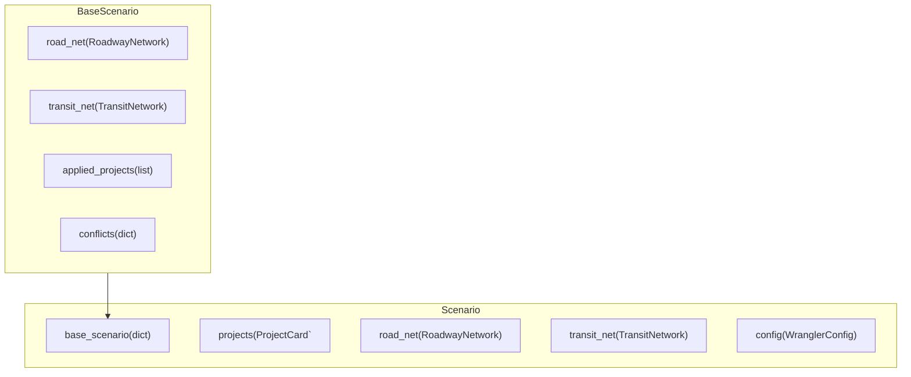

# Design

## Atomic Parts



NetworkWrangler deals with four primary atomic parts:

**1. [`Scenario`](api.md#network_wrangler.scenario.Scenario)** objects describe a Roadway Network, Transit Network, and collection of Projects. Scenarios manage the addition and construction of projects on the network via projct cards including required pre-requisites, co-requisites, and conflicts. Scenarios can be based on or tiered from other scenarios but must at the very least be based on an existing roadway and/or transit network defined in `base_scenario`.

**2. [`RoadwayNetwork`](api.md#network_wrangler.roadway.network.RoadwayNetwork)** objects stores information about roadway nodes, directed links between nodes, and the shapes of links (note that the same shape can be shared between two or more links). Network Wrangler reads/writes roadway network objects from/to three files: `links`, `shape`, and `nodes`. Their data is stored as GeoDataFrames in the object.

**3. [`TransitNetwork`](api.md#network_wrangler.transit.network.TransitNetwork)** objects contain information about the service (represented by the GTFS-compatable `Feed` object with stops, routes, trips, shapes, stoptimes, and frequencies tables), and how it maps to a `RoadwayNetwork`, stored as `road_net` attribute.  Network Wrangler reads/writes transit network information from/to gtfs-like files and stores them as DataFrames within.

**4.[`ProjectCard`](https://network-wrangler.github.io/projectcard/main/api/#projectcard.projectcard.ProjectCard)** objects store information (including  metadata) about changes to the network.  Network Wrangler uses the [`projectcard`](https://network-wrangler.github.io/projectcard) package to read project cards from .yaml-like files and validate them.

## Applying Projects

The basic functionality of NetworkWrangler is to apply a set of projects to a scenario.

```python
from project_card import read_cards
cards = read_cards([
    "projects/project_a.yml",
    "projects/project_b.yml",
    "projects/project_c.yml",
])
my_scenario.add_project_cards(cards.values())
my_scenario.queued_projects
>>  ["project_a", "project_b", "project_c"]
my_scenario.apply_projects(["project_a"])
my_scenario.applied_projects
>> ["project_a"]
my_scenario.queued_projects
>>  ["project_b", "project_c"]
my_scenario.apply_all_projects()
my_scenario.applied_projects
>> ["project_a", "project_b", "project_c"]
```

### Project Dependencies

Each project can specify any number of other projects (by project name) as a:

- `prerequisite`: list of projects that **must** be applied before this one.
- `corequisite`: list of projects that **must** be applied alongside this one (but not necessarily first).
- `conflicts`: list of projects that **must not** be applied to the same scenario as this one.

The Scenario object keeps track of the applied projects to make sure that these dependencies are enforced.

!!! warning "Base Scenarios with applied projects"

    Make sure your base scenario contains your applied projects and their conflicts.  This can be easily enforced by either loading a scenario from its .yml file or if you are seeding the base_scenario with an actual Scenario object instead of a dictionary.

### Order of project application

The order projects are applied defaults to the order they are specified in `my_scenario.projects`.  If a project card lists another project as a `prerequisite`, then NetworkWrangler will re-arrange the queued projects to make sure that is applied first.

This order can always be reviewed in `my_scenario.queued_projects`.

### Existing Values

You can control the behavior of Network Wrangler if existing value is not equal to the `existing` attribute in a ProjectCard as follows:

- `error`: Raise an error.
- `skip`: Skips applying the project.
- `warn`: Writes a warning about conflicting values. This is the global default.

These options can be set at the **global** configuration level by using WranglerConfig.

```yaml
EDITS:
    EXISTING_VALUE_CONFLIC: warn
```

This behavior can be overridden within a project card for a `roadway_property_change` or `transit_property_change` project for any individual `property_changes` item.

```yaml
transit_property_change:
    property_changes:
        headway_secs:
            existing: 360
            change: -180
            existing_value_conflict: error # this overrides the setting in WranglerConfig to error if the existing value is not 360.
```

### Scoped Roadway Property Changes

In some cases, properties of a roadway network may apply only during certain times of the day or for certain categories of users (e.g. trucks, HOV2, etc).  The Network Wrangler data model provides the ability to scope each property using the syntax described in the [network documentation](networks.md#scoped_properties).

The value for a scoped property for a given link record is a list of [ScopedLinkValueItem](networks.md#scoped_properties) objects.

::: network_wrangler.models.roadway.types.ScopedLinkValueItem
    options:
        show_bases: false
        show_root_toc_entry: false
        heading_level: 3
        show_source: false
        members: false

There are a few ways that network wrangler can treat conflicts:

- `conflicting` (default behavior):  overwrite any *conflicting* scoped properties for that property/link with what is given in the project card.
- `all`: overwrite *all* scoped properties for that property/link with what is given in the project card.
- `error`: raise an error when a conflict is detected.

These options can be set at the **global** configuration level by using WranglerConfig.

```yaml
EDITS:
    OVERWRITE_SCOPED: error # will default to raising an error if any scoped value in this specific property change conflicts with this scope.
```

This behavior can be overridden within a project card for a `roadway_property_change` project for any individual `property_changes` item.

```yaml
roadway_property_change:
    property_changes:
        sc_myproperty:
            set: 1
            scoped:
                timespan: [[12:00, 15:00]]
                set: 2
            overwrite_scoped: all # will overwrite all scopes in a link/property. Useful if you are completely defining something rather than amending.
```
